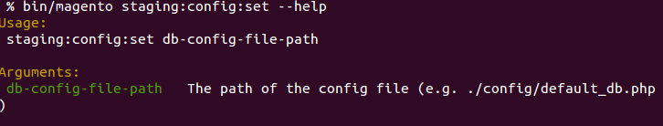
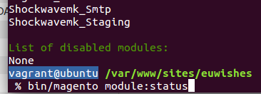
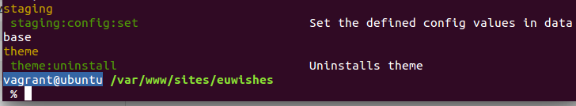
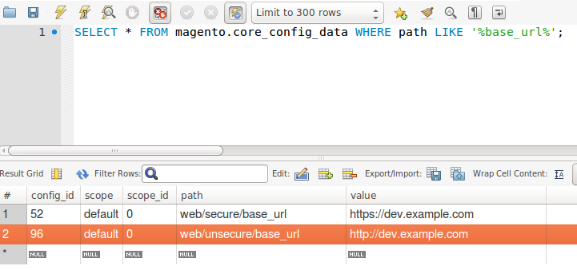

# Magento2 Command-Line Tools For Staging Support

A Magento2 setup for a well structured development process needs the setup of development, integration and production environments.

While staging the database from production server to integration with help of backup console command (bin/magento setup:backup) minor repeating problems occur:
Some settings defined in database have to be changed on staging, for example 'web/secure/base_url'.

In order to avoid this repeating task, it should be possible to define different config files overriding this settings in database.
That is the purpose of this module.

# Installation

Add the module to your composer file.

´´´json
    {
      
      ...
      
      "require": {
        ...
        
        "shockwavemk/magento2-module-console-staging": "dev-master",
        
        ...
      },
      
      ...

´´´

Decide if you want to use symlink-strategy

´´´json
    {
      
      ...
      
      "extra": {
          "magento-root-dir": ".",
          "magento-deploystrategy": "copy",
          "magento-deploystrategy-overwrite": {
            ...
            
            "shockwavemk/magento2-module-console-staging": "symlink"
          },
          "auto-append-gitignore": true
        },
      
      ...

´´´

Install the module with composer

´´´bash

    composer update

´´´

On succeed, install the module via bin/magento console:

´´´bash

    bin/magento cache:clean
    
    bin/magento module:install Shockwavemk_Staging
    
    bin/magento setup:upgrade

´´´

You should be able to see a new command in bin/magento console:

# Usage

## Create configuration file

Create a configuration php file in your project directory (or a subfolder or elsewhere on your server)

´´´php

    <?php
    return array (
        'default' =>
            array(
                '0' => array(
                    'web/unsecure/base_url' => 'http://dev.example.com',
                    'web/secure/base_url' => 'https://dev.example.com'
                )
            )
        );
        
´´´

## Execute command

´´´bash

    < project-path >/bin/magento staging:config:set ./config/magento/default_db.php
    
´´´

## Result in database

